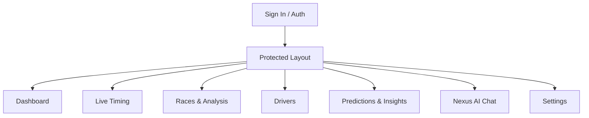

# F1 Nexus — Design System & Architecture Specification

This document details the visual design, user experience guidelines, and complete page-by-page feature map for the **F1 Nexus** platform.

The design is heavily inspired by the modern, premium aesthetics of **Google Stitch** and **Apple Music**, utilizing a deep dark glassmorphic interface, organic ambient glows, precise geometric accents, and responsive micro-animations.

---

## 1. Visual Design Language (The Glassmorphic System)

### A. Color Palette
Our color scheme is tuned for a high-end, premium dark mode:
* **Base Background**: Deep Space Black (`#070a13` to `#0d1321` gradient)
* **Glow/Accent Core**: F1 Crimson Red (`#ef4444` / HSL `0 84% 60%`), Electric Blue (`#3b82f6` / HSL `217 91% 60%`), and Neon Violet (`#8b5cf6` / HSL `258 90% 66%`)
* **Frosted Fills**:
  * Primary Glass: `rgba(15, 23, 42, 0.45)` (Slate 900 at 45% opacity)
  * Hover Glass: `rgba(30, 41, 59, 0.65)` (Slate 800 at 65% opacity)
* **Border Strokes**: Very thin, semi-transparent white: `1px solid rgba(255, 255, 255, 0.08)`

### B. Glassmorphism Specifications (Frosted Glass)
To achieve the deep glass effect seen on Google Stitch and Apple Music, cards and panels must adhere to the following properties:
```css
.glass-card {
  background: rgba(15, 23, 42, 0.45);
  backdrop-filter: blur(16px) saturate(180%);
  -webkit-backdrop-filter: blur(16px) saturate(180%);
  border: 1px solid rgba(255, 255, 255, 0.08);
  border-radius: 16px; /* Generous rounded corners */
  box-shadow: 
    0 4px 30px rgba(0, 0, 0, 0.4),
    inset 0 1px 1px rgba(255, 255, 255, 0.05);
}
```

### C. Depth & Ambient Backdrops
* **Organic Glows**: Dynamic, blurry colorful blobs behind the panels to simulate depth. Created using absolute-positioned radial gradients with large blur radiuses:
  ```css
  .ambient-glow {
    filter: blur(120px);
    opacity: 0.15;
    background: radial-gradient(circle, var(--accent-color) 0%, transparent 70%);
  }
  ```
* **Dot Grid Pattern**: A fine dot overlay covering the primary viewport background to ground the glass cards:
  ```css
  .dot-grid {
    background-image: radial-gradient(rgba(255, 255, 255, 0.07) 1px, transparent 1px);
    background-size: 24px 24px;
  }
  ```

### D. Geometry & Rounded Corners
* **Sidebar & Panels**: Deep `24px` border radius on main containers and floating sidebar panels.
* **Buttons & Badges**: Fully pill-shaped (`9999px`) or `12px` rounded corners.
* **Inputs & Form controls**: Smooth `10px` radius with soft white border glowing into red/blue on active focus.

### E. Micro-Animations & Floating Transitions
* **Hover Actions**: Subtle scale-up and floating transition:
  ```css
  .hover-float {
    transition: transform 0.3s cubic-bezier(0.4, 0, 0.2, 1), box-shadow 0.3s ease;
  }
  .hover-float:hover {
    transform: translateY(-4px) scale(1.015);
    box-shadow: 0 12px 40px rgba(239, 68, 68, 0.1);
    border-color: rgba(255, 255, 255, 0.15);
  }
  ```
* **Active Status**: High-priority indicators (e.g. `LIVE` telemetry tag) animate with a continuous soft pulse:
  ```css
  @keyframes status-pulse {
    0% { transform: scale(0.95); opacity: 0.8; }
    50% { transform: scale(1.05); opacity: 1; }
    100% { transform: scale(0.95); opacity: 0.8; }
  }
  ```

---

## 2. Webpage Layout & Features Map

F1 Nexus is structured as a modern, protected multi-page application with a floating persistent navigation sidebar.



---

### Page 1: Dashboard (`/dashboard`)
The central command center providing a quick overview of the current season state and immediate actions.

* **Layout**: Multi-column grid layout with glass cards.
* **Features**:
  1. **Next Race Countdown**: Floating glass banner displaying the Grand Prix title, location, countdown timer to the next practice/qualifying/race, and local time conversion in IST.
  2. **Active Timing Indicator**: Dynamic badge linking directly to the Live Timing screen if a live session is currently active.
  3. **Championship Standings Widget**: Frosted-glass mini-standings list showing the top 5 drivers, constructor logos, and expected points gap.
  4. **Recent Activities & Quick Links**: Shortcuts to AI Strategy recommendations, recent GP reports, and driver profile pages.

---

### Page 2: Live Timing (`/live`)
The high-intensity real-time telemetry screen. Emulates the pit-wall experience with streaming web-socket feeds.

* **Layout**: Full-screen grid view. Telemetry table on the left, interactive strategy panels on the right.
* **Features**:
  1. **Live Leaderboard**: Real-time position tracking, gaps to leader, gap ahead, compound indicators (SOFT, MEDIUM, HARD, INTERMEDIATE, WET), tyre age (in laps), sector times (S1, S2, S3), and pit indicators.
  2. **DRS & Pitting Badges**: Animated micro-badges that blink when a driver enters the pit lane or opens their DRS wing.
  3. **Floating WS Ticker**: Reconnect indicator mapping socket status smoothly with micro-animations.
  4. **Telemetry Chart**: Floating live charts illustrating lap time consistency and delta trends.

---

### Page 3: Races & Analysis (`/races`)
Historical archive and post-race tire strategy breakdowns.

* **Layout**: Split chronological list to detailed analysis page (`/races/[year]/[round]`).
* **Features**:
  1. **Season Calendar Timeline**: An elegant vertical timeline mapping out completed rounds and upcoming locations.
  2. **Tire Stint Timeline Chart**: A horizontal bar chart mapping every driver's stint duration and tyre compounds used during the GP.
  3. **Degradation Analysis Curves**: Custom interactive SVG graphs displaying predicted tyre degradation curves (XGBoost models) vs actual lap times for the top 3 finishers.
  4. **Paginated Lap Logs**: Full tabular records of every lap filtered by driver, lap number range, and compound.

---

### Page 4: Drivers (`/drivers`)
Profiles and analytics for all active drivers.

* **Layout**: Grid cards (main list) transitioning to a detailed layout (`/drivers/[code]`).
* **Features**:
  1. **Driver Grid**: Glass cards with premium hover scaling, displaying the driver’s profile portrait (using local asset overrides), abbreviation code, nationality, and team.
  2. **Performance Metrics**: Spider/radar charts mapping driver consistency, wet pace, qualifying speed, and overtake rating.
  3. **Stint History Graph**: Interactive chart showing the driver's historical tyre wear patterns.

---

### Page 5: Predictions & Insights (`/predictions`)
Championship forecasts and weekend form predictions.

* **Layout**: Segmented control switching between **Season** and **Race Weekend** views.
* **Features**:
  1. **Monte Carlo Forecast Chart**: Interactive bar chart displaying championship win probabilities for the top 10 contenders over 10,000 simulations.
  2. **Expected Standings Table**: Predicted final standings table listing expected final points and probabilities.
  3. **Weekend Form Analytics**: Form ratings based on recent performance (past 5 rounds blended with historical priors).
  4. **Strategy Window Preview**: Interactive recommendation card showing ideal pit stops and recommended laps.

---

### Page 6: Nexus AI Chat (`/chat`)
Provider-agnostic conversational AI assistant injected with live telemetry context.

* **Layout**: Full-height chat container with floating messages, stylized user bubble, and system-integrated responses.
* **Features**:
  1. **Groq/Gemini LLM Provider**: Backed by high-speed LLM processing.
  2. **Context-Aware Assistance**: The prompt automatically injects active race data, standings, and track status.
  3. **Predefined Prompts**: Floating pill-shaped buttons at the bottom offering quick-queries (e.g., *"Who has the best tyre degradation?"*, *"Predict when RUS will pit"*).
  4. **Typing Micro-Animations**: Animated dots indicating active generation response.

---

### Page 7: Settings (`/settings`)
Configuration panel for notifications and interface preferences.

* **Layout**: Single-column form sections inside large glass cards.
* **Features**:
  1. **Push Notifications Settings**: Web push registrations to subscribe to safety cars, pit stops, and race start alerts.
  2. **Profile & Account Preferences**: Customizable profile avatars, email fields, and constructor favorites.
  3. **API Settings Override**: Toggles to trigger simulated timing feeds or modify cache TTL.
